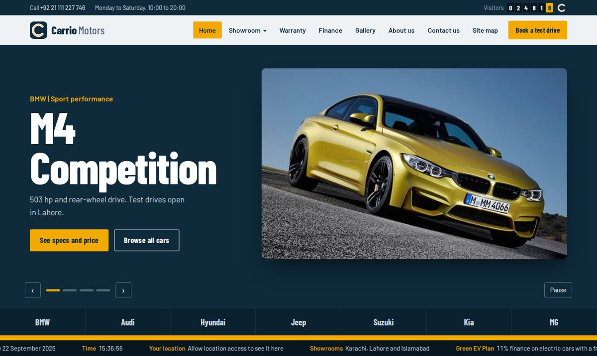
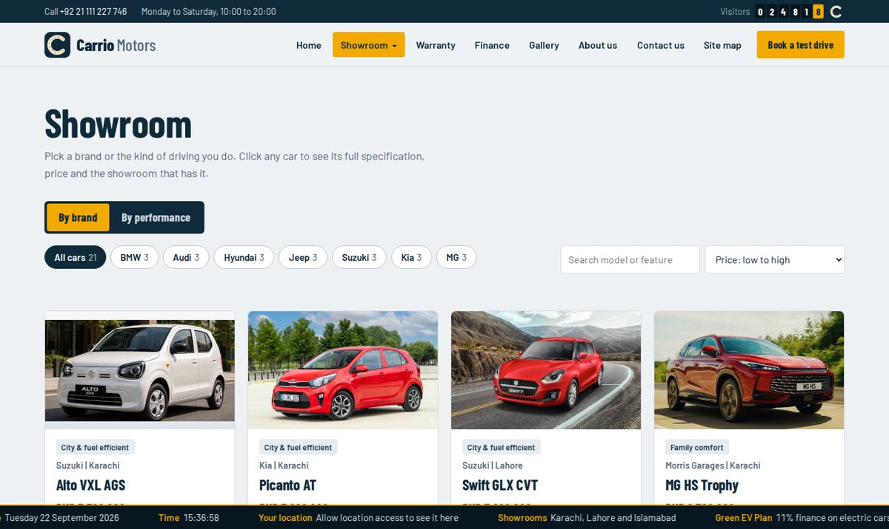
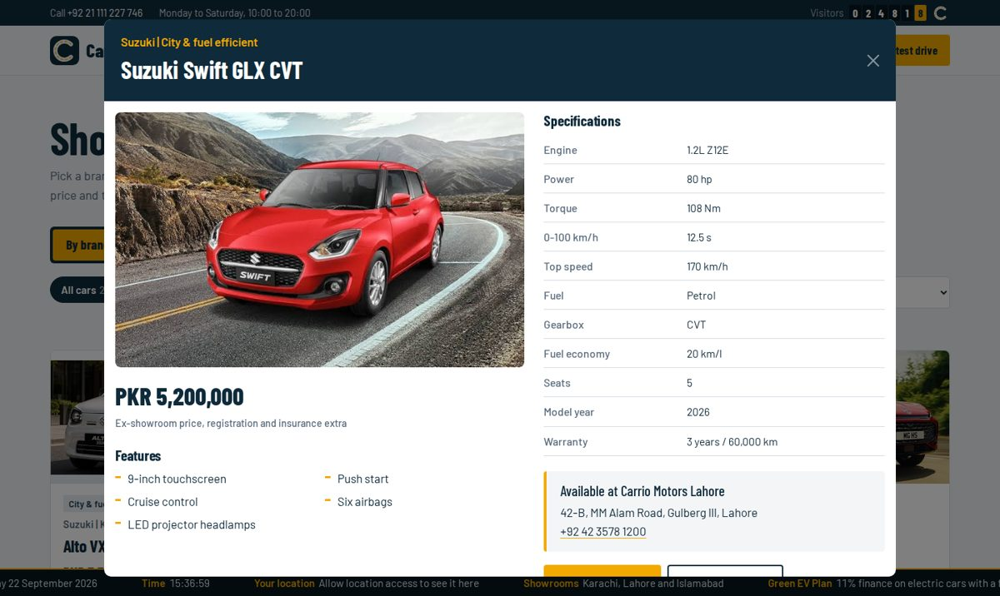
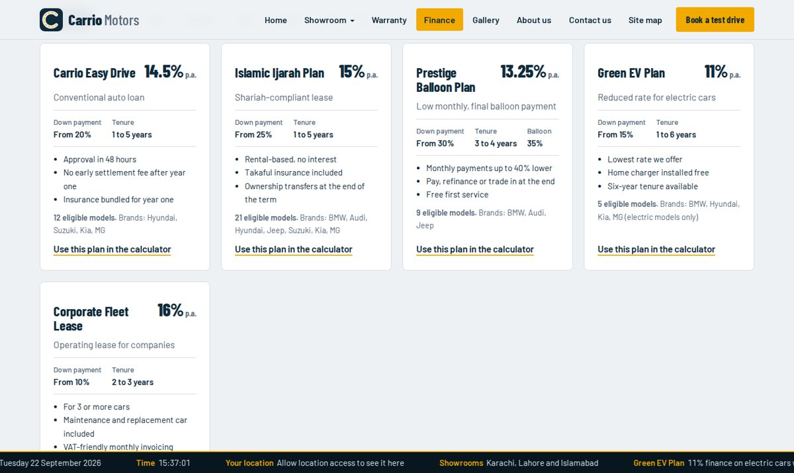
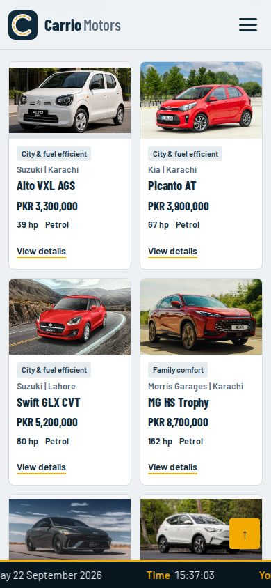

# Carrio Motors

A responsive, multi-page website for **Carrio Motors**, a car dealership selling BMW, Audi, Hyundai, Jeep, Suzuki, Kia and MG. Built as a 1st semester eProject at Aptech (batch P2-2406T6).



## Features

- **Car slider** on the home page with pause, arrows and dots
- **Showroom** with 21 cars, sorted by brand or by performance (city, family, luxury, sport, off-road, electric), plus search and sorting
- **Car details popup**: photo, price, features, specifications, warranty and dealer location
- **Warranty** cover for each brand, with a side-by-side comparison table
- **Finance** plans for different models and brands, with a monthly payment (EMI) calculator
- **Gallery** with a lightbox
- **About us**, **Contact us** (with enquiry and test drive form) and **Site map**
- **Scrolling ticker** at the bottom with the current date, time and location (HTML5 Geolocation)
- **Visitor count** beside the logo, styled like a car odometer
- Menu colour changes on hover and after a click; drop-downs fade in and out
- Fully responsive: phone, tablet and desktop

## Pages

| Page | Content |
|---|---|
| `index.html` | Home: slider, stats, featured cars, performance groups, offers, showrooms |
| `showroom.html` | All cars by brand or performance, search, sort, details popup |
| `warranty.html` | Warranty by brand and comparison table |
| `finance.html` | Finance plans and payment calculator |
| `gallery.html` | Car gallery with lightbox |
| `about.html` | About the company and its showrooms |
| `contact.html` | Contact details and enquiry form |
| `sitemap.html` | Links to every part of the site |

## Screenshots

| Showroom | Car popup |
|---|---|
|  |  |

| Finance calculator | Mobile |
|---|---|
|  |  |

## Built with

HTML5, CSS3, Bootstrap 5.3, JavaScript, jQuery 3.7, JSON (data store), XML (`sitemap.xml`) and SVG.
Bootstrap, jQuery and the fonts are included locally, so the site works offline.

## How to run

1. Clone or download this repository.
2. Open `index.html` in any modern browser (Chrome, Edge, Firefox or Safari).

For the best result, open the folder in VS Code and use the **Live Server** extension. The site then reads the JSON files directly, and location works on `http://localhost`.

No database, server or installation is needed.

## Project structure

```
├── index.html, showroom.html, warranty.html, finance.html,
│   gallery.html, about.html, contact.html, sitemap.html
├── assets/
│   ├── css/style.css      custom styles and responsive rules
│   ├── js/app.js          all features, shared by every page
│   ├── js/car-art.js      SVG car drawing used if a photo is missing
│   ├── vendor/            Bootstrap and jQuery
│   └── fonts/             Barlow and Barlow Condensed
├── data/                  JSON data: cars, brands, categories, warranty,
│                          finance, company, slides, gallery
├── images/                logo and car photos (images/cars/<car-id>.jpg)
├── screenshots/           images used in this README
└── sitemap.xml
```

## Notes

- Prices, specifications, warranty terms and finance rates are sample data for the project.
- The visitor count and contact form enquiries are stored in the browser (localStorage), as the project has no server.
- If you edit a file in `data/`, update `data/data-fallback.js` too, so the site still works when opened directly from disk.
- Car photos are from free image websites and are used for educational purposes.

## Team

| Enrollment No. | Name |
|---|---|
| Student1578010 | Muhammad Afnan Khan |
| Student1575911 | Muhammad Noor |
| Student1575906 | Muhammad Aliyan Akhtar |
| Student1575909 | Muhammad Waris |
| Student1562422 | Ubaid Ullah |
